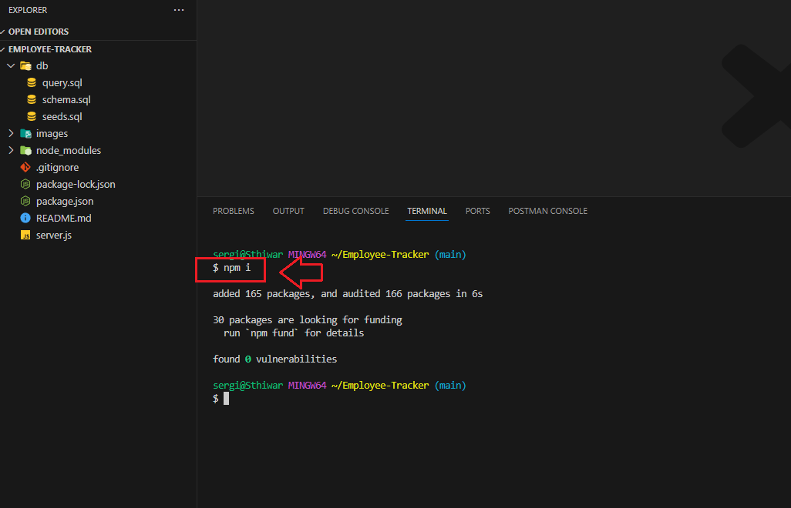
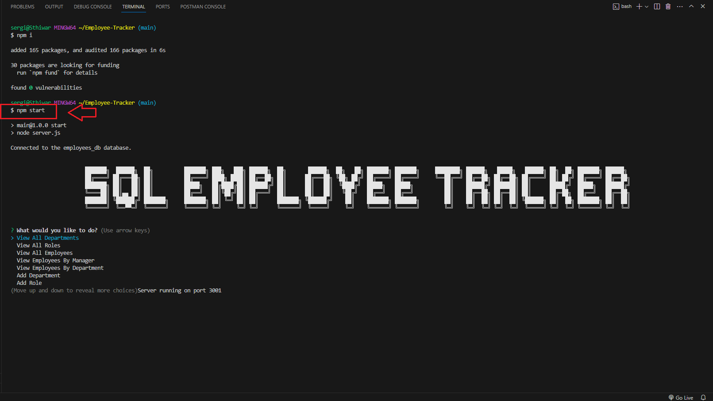
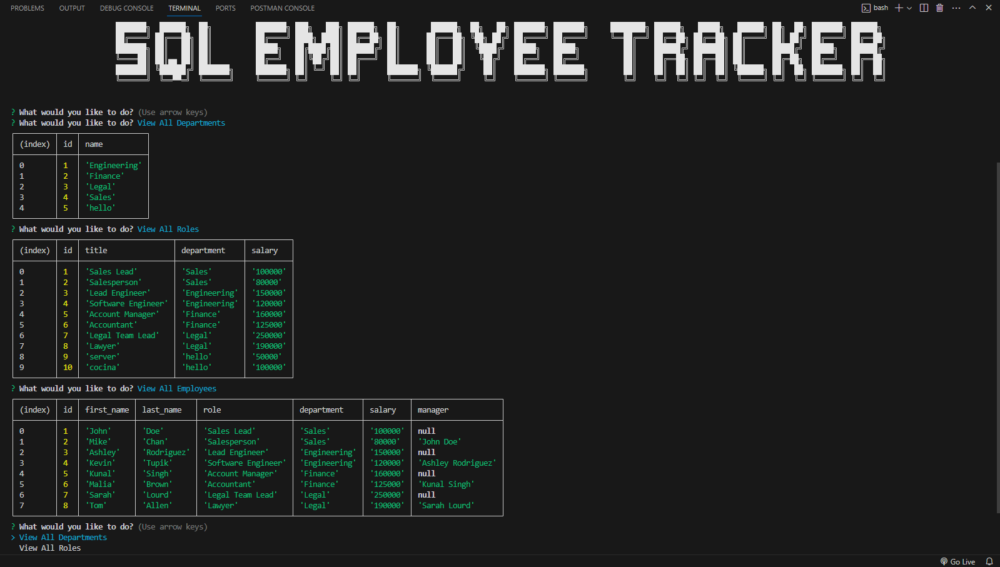

# Employee-Tracker

## Description  :bookmark_tabs:
Employee Tracker project was particularly rewarding; as soon as I realized what this project was I got really excited because because it addresses a real-world need that many companies face. Despite its simplicity, the application has the potential to significantly improve the efficiency of employee management processes. Moreover, I enjoyed the process of developing and styling the CLI interface, adding a creative touch to the project, such a bigger title, colors, emojis. 
Employee Tracker is a command-line application built using MySQL and Inquirer. It serves as a simple yet efficient tool for managing employee data within a company. With features such as adding, viewing, updating, and deleting employee records/data, as well as managing departments and roles, the application streamlines the process of employee management. I learned a lot of things throughout this project, some of those are having experience in setting up and managing a MySQL database, creating tables, defining relationships between them, error handling, styling the command-line interface (CLI) and way more. Overall, I am proud of the practical utility and user-friendly design of my application.
## Installation :computer:

You are able to check this app by two ways:

 1. If you want to check a video of the functionality of the app, you can go to this URL: https://drive.google.com/file/d/1IkUFSgyw0KmJJ_YRdgSe5gWlImhIEvTu/view 
 2. If you want to try it yourself, you have to have "Node.js" installed in your computer, then you have to clone my repository and run it locally.

## Usage :bar_chart:

If you want to try the app yourself make sure you have "Node.js" in your computer, and do not forget to run the next lines of code to start the app:
    
    npm i

 
 
 ---
After that run one of the next line:

    npm start

 
 ---
You will be prompted with a title of the app and a list of options to choose, after selecting the action you want to process, either it will show you right away like the next example: 

 
 ---
Or it will ask you a couple questios to finalize the request:

 
 ---
You can select "Quit" so the app will shut down.
## Credits :email:

List of all the links that made me succeed this project:
- https://dev.mysql.com/doc/refman/8.0/en/problems-with-null.html#:~:text=To%20look%20for%20NULL%20values,See%20Section%205.3.
- https://www.w3schools.com/sql/func_mysql_case.asp 
- https://www.geeksforgeeks.org/sql-join-set-1-inner-left-right-and-full-joins/
- https://learn.microsoft.com/en-us/sql/t-sql/queries/select-transact-sql?view=sql-server-ver16
- https://www.digitalocean.com/community/tutorials/nodejs-interactive-command-line-prompts
- https://stackoverflow.com/questions/66658612/nodejs-set-variable-inside-switch-statement-then-pass-it-to-axios
- https://developer.mozilla.org/en-US/docs/Web/JavaScript/Reference/Statements/switch
- https://developer.mozilla.org/en-US/docs/Web/API/console/table_static
- https://stackoverflow.com/questions/75175085/typeerror-cannot-read-properties-of-undefined-reading-status-in-axios
- https://developer.mozilla.org/en-US/docs/Web/JavaScript/Reference/Global_Objects/Array/map
- https://www.w3schools.com/sql/sql_orderby.asp
- https://stackoverflow.com/questions/19544452/remove-last-item-from-array
- https://javascript.plainenglish.io/how-to-inquirer-js-c10a4e05ef1f
- https://github.com/dominikwilkowski/cfonts
- https://github.com/dominikwilkowski/cfonts?tab=readme-ov-file
- https://gist.github.com/abritinthebay/d80eb99b2726c83feb0d97eab95206c4
- https://github-emoji-picker.rickstaa.dev/

## License :memo:
---
---
MIT License

Copyright (c) 2023 Sergio S. Ardila-Alvarado

Permission is hereby granted, free of charge, to any person obtaining a copy
of this software and associated documentation files (the "Software"), to deal
in the Software without restriction, including without limitation the rights
to use, copy, modify, merge, publish, distribute, sublicense, and/or sell
copies of the Software, and to permit persons to whom the Software is
furnished to do so, subject to the following conditions:

The above copyright notice and this permission notice shall be included in all
copies or substantial portions of the Software.

THE SOFTWARE IS PROVIDED "AS IS", WITHOUT WARRANTY OF ANY KIND, EXPRESS OR
IMPLIED, INCLUDING BUT NOT LIMITED TO THE WARRANTIES OF MERCHANTABILITY,
FITNESS FOR A PARTICULAR PURPOSE AND NONINFRINGEMENT. IN NO EVENT SHALL THE
AUTHORS OR COPYRIGHT HOLDERS BE LIABLE FOR ANY CLAIM, DAMAGES OR OTHER
LIABILITY, WHETHER IN AN ACTION OF CONTRACT, TORT OR OTHERWISE, ARISING FROM,
OUT OF OR IN CONNECTION WITH THE SOFTWARE OR THE USE OR OTHER DEALINGS IN THE
SOFTWARE.

---
---
